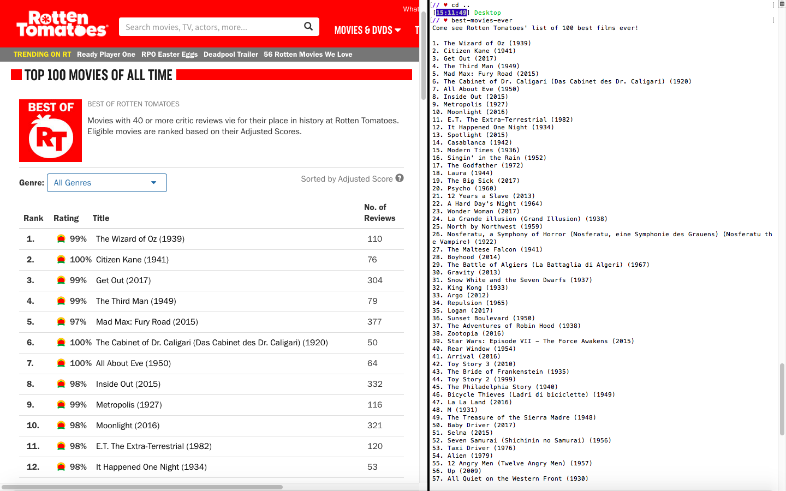

# BestMoviesEver

This [published](https://rubygems.org/gems/best-movies-ever-cli-gem/versions/0.1.0) gem will list 100 best films of all time according to Rotten Tomatoes.  
Users can find out more about a specific movie by typing the Rotten Tomatoes' ranking.

## Installation

    $ gem install best-movies-ever-cli-gem

## Usage

    For local version: check into the best-movies-ever-cli-gem directory,
    then run:
      bin/best-movies-ever

    and then follow the on-screen prompts.

    For rubygems.org version, run:

    $ best-movies-ever

    and then follow the on-screen prompts.

## Development

After checking out the repo, run `bin/setup` to install dependencies. Then, run `rake spec` to run the tests. You can also run `bin/console` for an interactive prompt that will allow you to experiment.

To install this gem onto your local machine, run `bundle exec rake install`. To release a new version, update the version number in `version.rb`, and then run `bundle exec rake release`, which will create a git tag for the version, push git commits and tags, and push the `.gem` file to [rubygems.org](https://rubygems.org).

## Contributing

Bug reports and pull requests are welcome on GitHub at https://github.com/kevinYCKim33/best_movies_ever. This project is intended to be a safe, welcoming space for collaboration, and contributors are expected to adhere to the [Contributor Covenant](http://contributor-covenant.org) code of conduct.

## License

The gem is available as open source under the terms of the [MIT License](http://opensource.org/licenses/MIT).

## Code of Conduct

Everyone interacting in the BestMoviesEver project’s codebases, issue trackers, chat rooms and mailing lists is expected to follow the [code of conduct](https://github.com/<github username>/best_movies_ever/blob/master/CODE_OF_CONDUCT.md).
